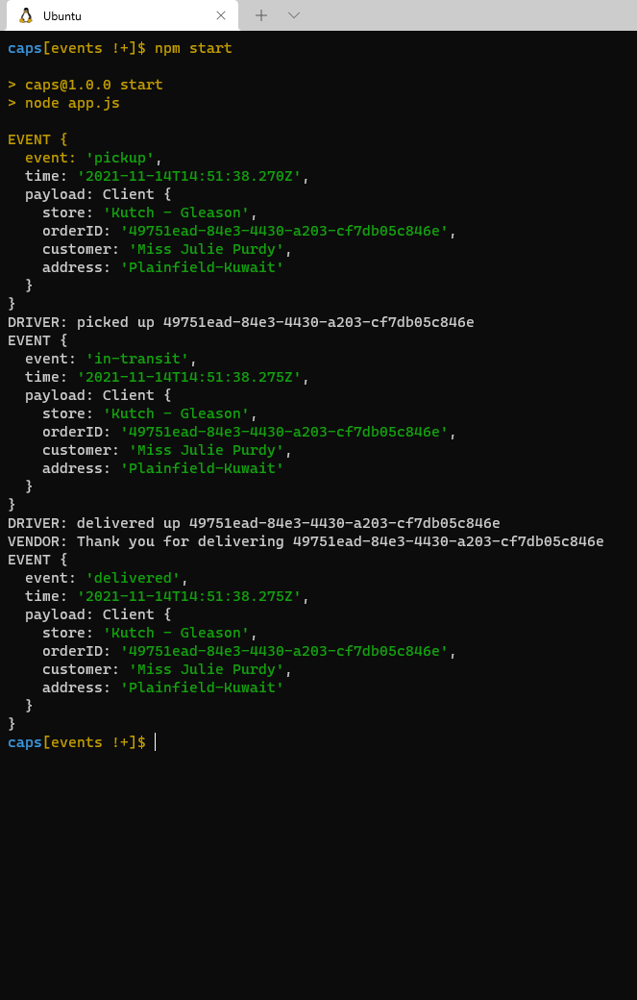
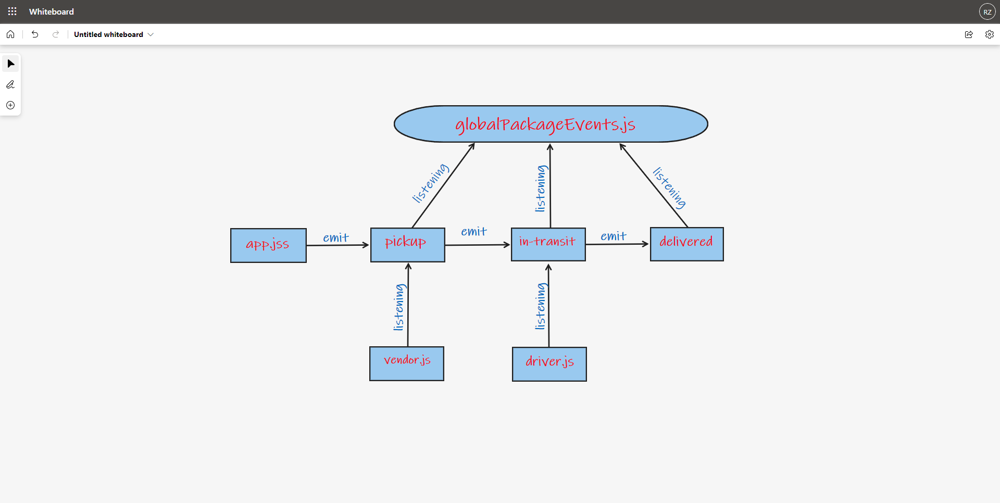

# caps

## Lab 10
## Author: 
- Rami Zregat

**Description of the lab:**  
In this lab we’ll build out a system that emulates a real world supply chain. CAPS will simulate a delivery service where vendors will ship products using our delivery service and when our drivers deliver them, be notified that their customers received what they purchased.

## Links to check:

- Github pull request link: https://github.com/RamiZregat/caps/pull/2
- Github actions link: https://github.com/RamiZregat/caps/actions

## Dependencies:  

- jest
- faker

## How to start the server:  
- npm start

## Output result

## UML

